.. _features:

========
Features
========

Public HTML interface
=====================

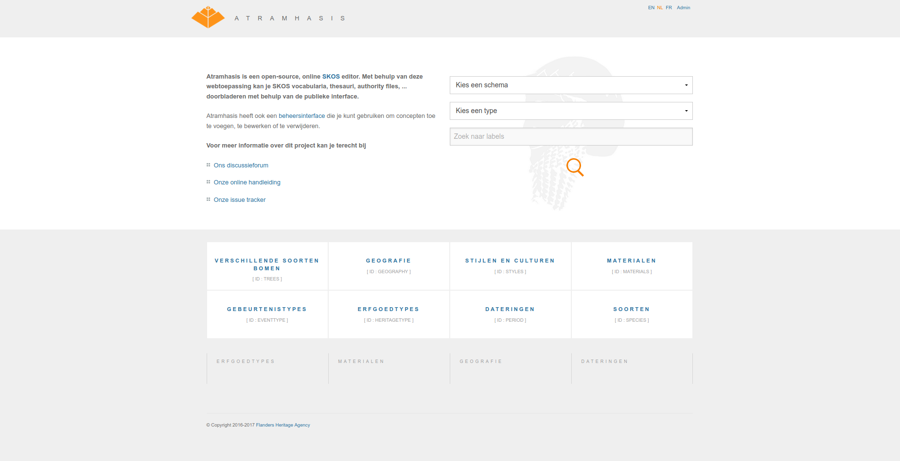

When visiting the homepage of an Atramhasis instance, users are presented with
a few different options. They can search for a certain label within a certain
conceptscheme. Links are presented to all the conceptschemes present in the
instance. For a list of (configurable) conceptschemes the most visited concepts
are displayed for easy and quick access. Notice that by default Atramhasis
comes with an English, French and Dutch public interface. Other languages can
easily be added.

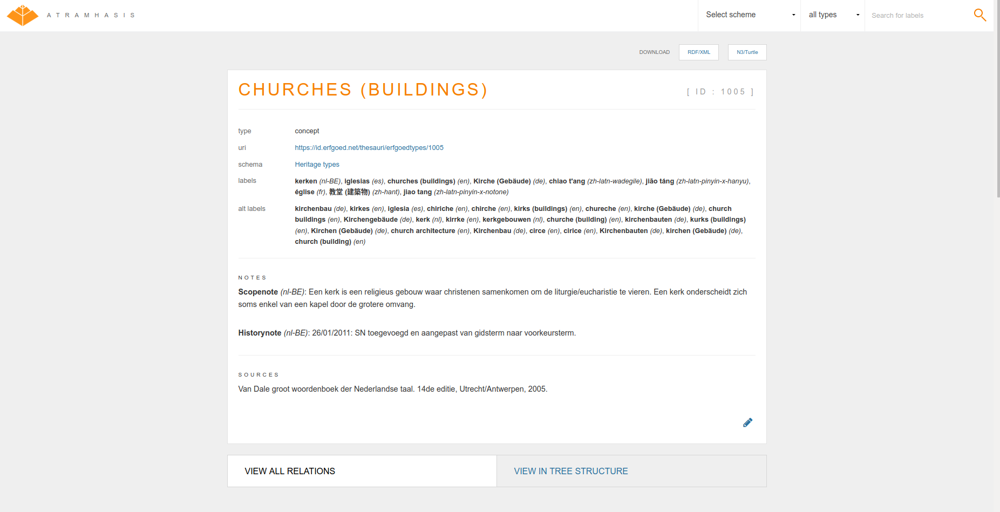

A concept detail page details one concept or collection. It lists the concept's
labels, notes and sources used in creating or researching the concept. Every
concept has an id (an identifier within a conceptscheme) and a
:term:`URI` that can be custom generated. For interoperability with other
applications, every detail has both `RDF/XML` and `N3/Turtle` downloads
available. As Atramhasis tries to take the user's preferred language settings
into account, it will try to provide the title of the page in the user's
preferred language, whilst also listing the labels separately.

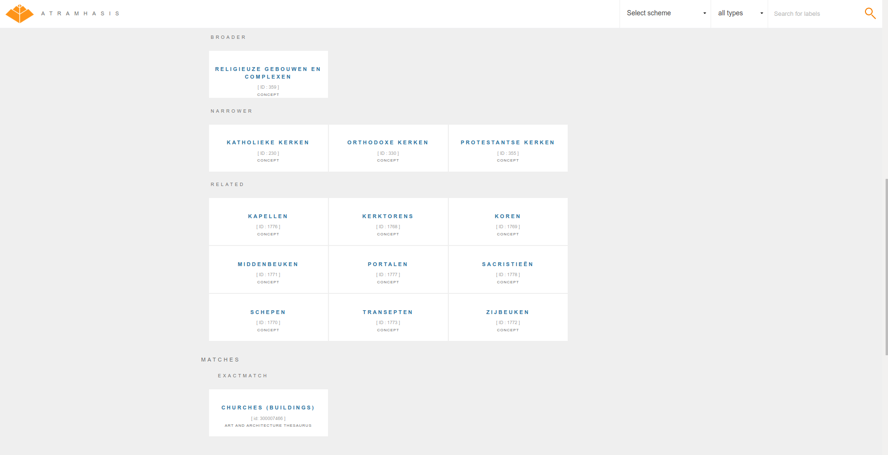

Scrolling further down on a detail page, we come to the relations between this
concept or collection and other concepts or collections. All common :term:`SKOS` 
relations (broader, narrower, related, member, ...) are accounted for. Links to
other conceptschemes (suh as the AAT) are supported with :term:`SKOS` matches.

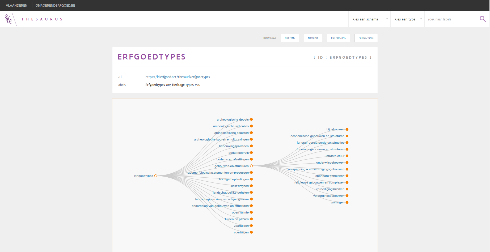

While every detail page presents the immediate relations for a certain concept
or collection, there's also a tree view available that presents all
broader/narrower relations for all concepts and collections in one go. This can be 
reached on the conceptscheme page or from every detail page. As can be seen
here, an Atramhasis instance can easily be reskinned for a certain
organisation. The `Flanders Heritage Thesaurus <https://thesaurus.onroerenderfgoed.be>`_ 
is an Atramhasis implementation with custom styling and authentication.

SKOS editor
===========

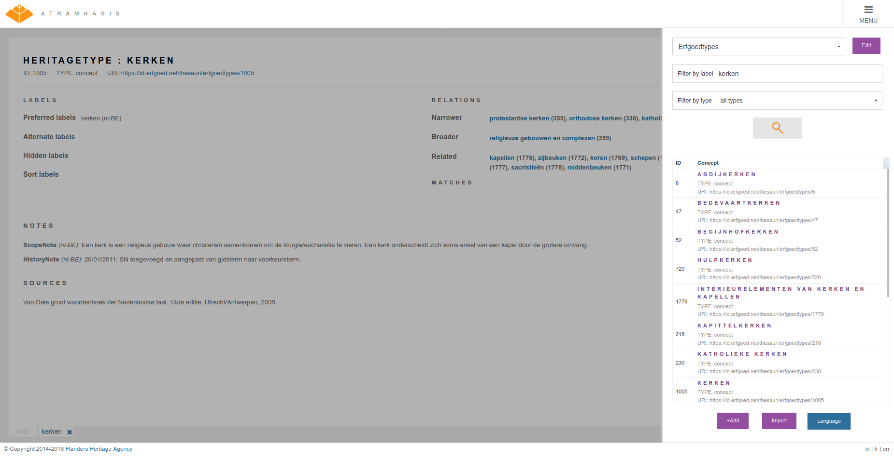

The Atramhasis admin interface allows editors to find a certain concept or
collection and edit or delete it. While it's also possiblel to edit
conceptscheme attributes this way, they always need some code configuration and
thus need to be created by a system administrator.

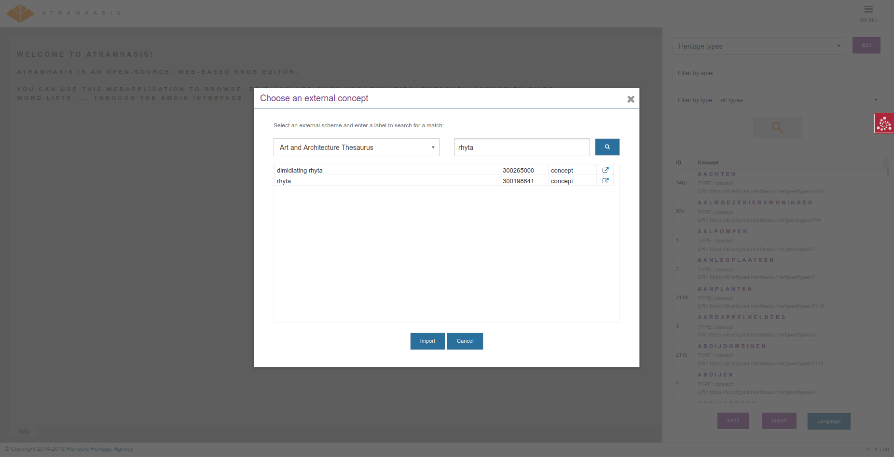

While you can define concepts from scratch, it's also possible to import a
concept from another thesaurus, such as the AAT. It will import labels and notes 
from the original concept and add an automatic :term:`SKOS` match back to the
original. Bear in mind that this actually creates a new concept with a new URI,
while referencing the original. If you want to import an entire thesaurus, you
need to go beyond the User Interface.

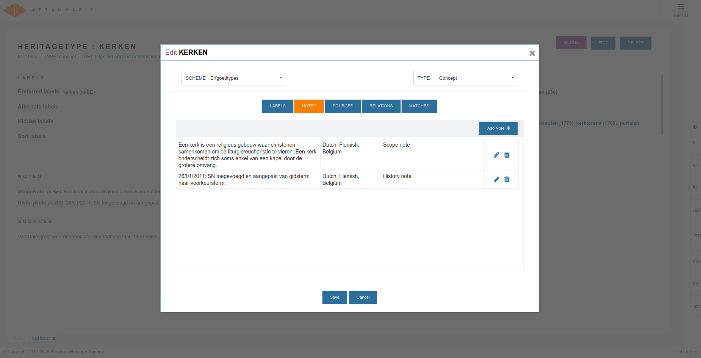

Editing a concept or collection is done using one or more tabs, such as the
notes tab to edit scopenotes, sourcenotes, ... Adding HTML markup is supported.

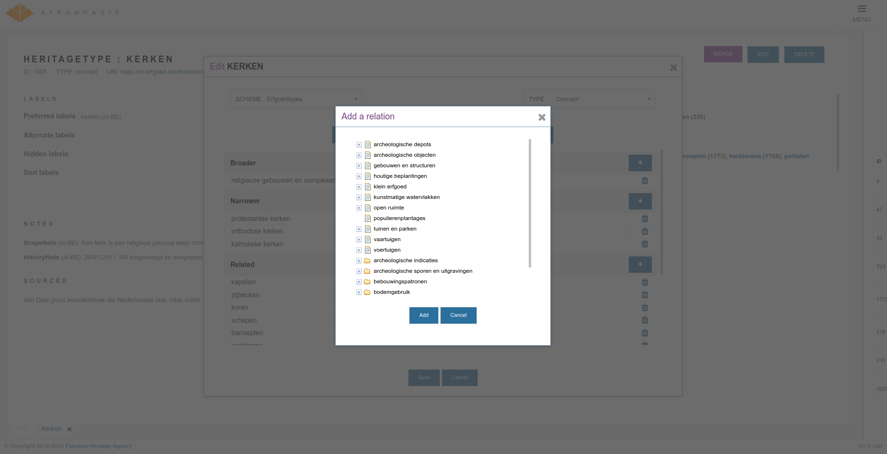

The relations tab allows editing the relations of concepts or collections with
other concepts or collectons. Dropdown lists are present to facilitate editing.

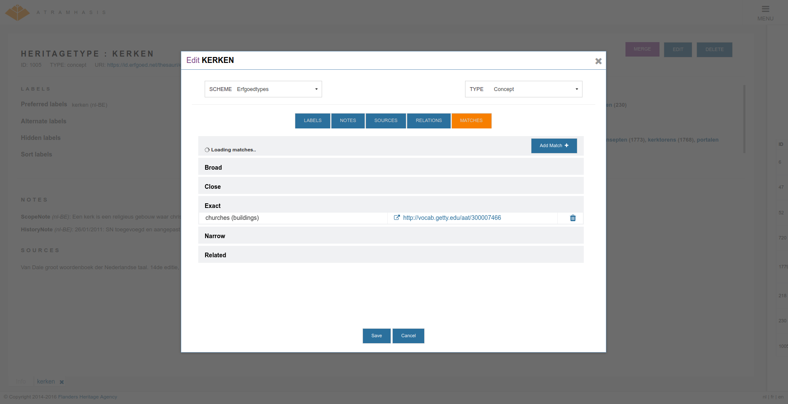

The matches tab allows an editor to match a local concept to a concept in a
remote conceptscheme.

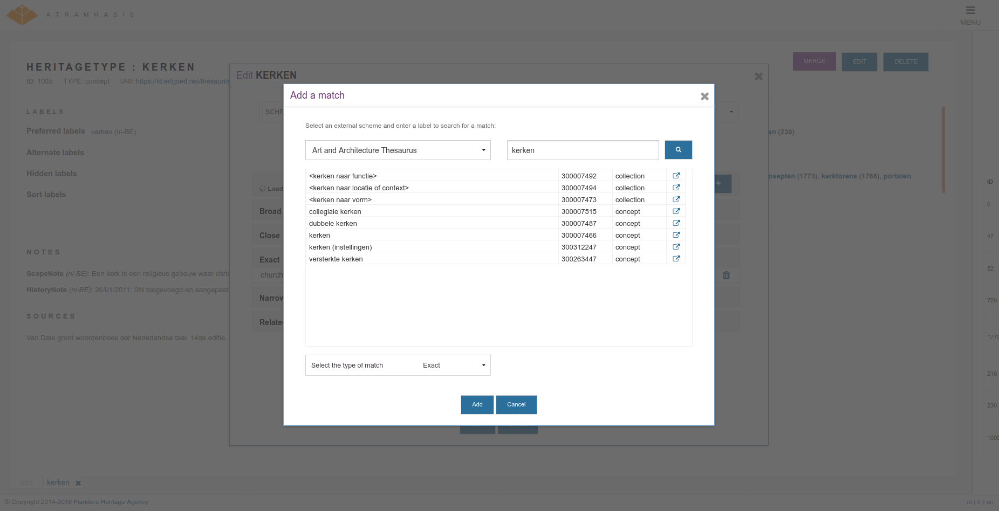

Using the `skosprovider` that powers a remote conceptscheme, matching concepts
can be searched for and added to the local concept.

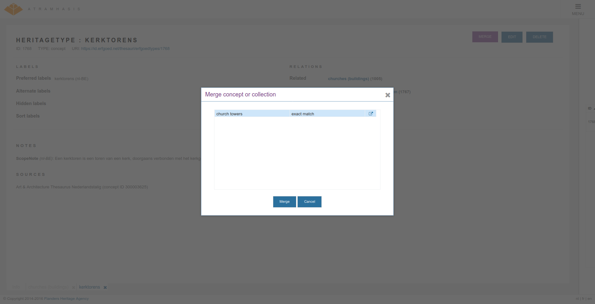

Once a concept has been matched with a concept from an external provider it's
possible to merge the two concepts. This is similar to importing a concept, but
works for concepts that already exist in your local thesaurus. Merging with
copy the labels and notes from the external concept. If you can link you
concept with an external concept that has labels for the concept in different
languages, this is a quick way to extend the number of languages supported by
your local concept. Before saving the results of the merge, you are free to
review the results of the merge and accept or reject certain labels and notes.

LDF server
==========

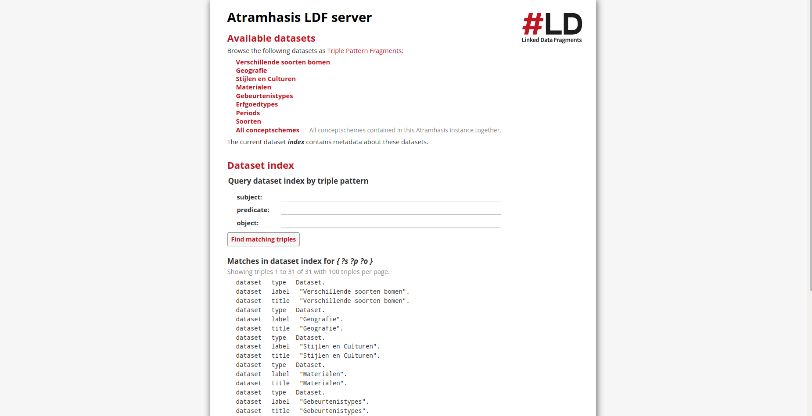

With a little bit of effort, Atramhasis can setup an LDF server for you,
allowing you to quickly serve RDF tripples.
