.. _features:

========
Features
========

Public HTML interface
=====================

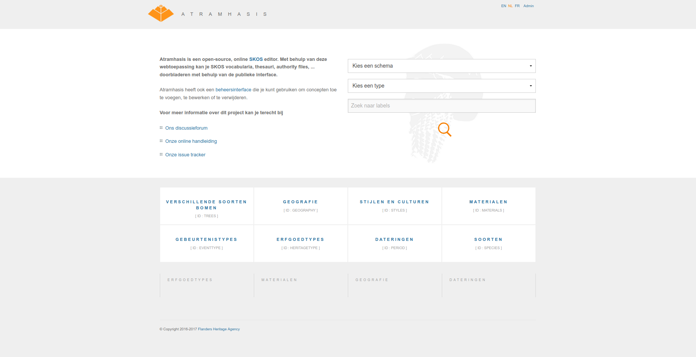

When visiting the homepage of an Atramhasis instance, users are presented with
a few different options. They can search for a certain label within a certain
conceptscheme. Links are presented to all the conceptschemes present in the
instance. For a list of (configurable) conceptschemes the most visited concepts
are displayed for easy and quick access. Notice that by default Atramhasis
comes with an English, French and Dutch public interface. Other languages can
easily be added.

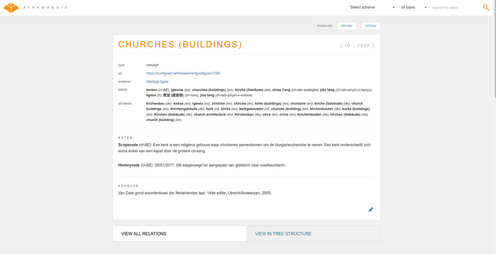

A concept detail page details one concept or collection. It lists the concept's
labels, notes and sources used in creating or researching the concept. Every
concept has an id (an identifier within a conceptscheme) and a
:term:`URI` that can be custom generated. For interoperability with other
applications, every detail has both `RDF/XML` and `N3/Turtle` downloads
available. As Atramhasis tries to take the user's preferred language settings
into account, it will try to provide the title of the page in the user's
preferred language, whilst also listing the labels separately.

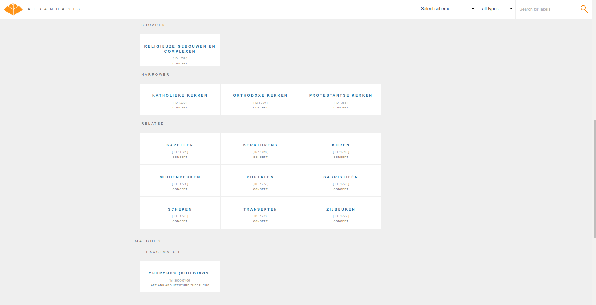

Scrolling further down on a detail page, we come to the relations between this
concept or collection and other concepts or collections. All common :term:`SKOS` 
relations (broader, narrower, related, member, ...) are accounted for. Links to
other conceptschemes (suh as the AAT) are supported with :term:`SKOS` matches.

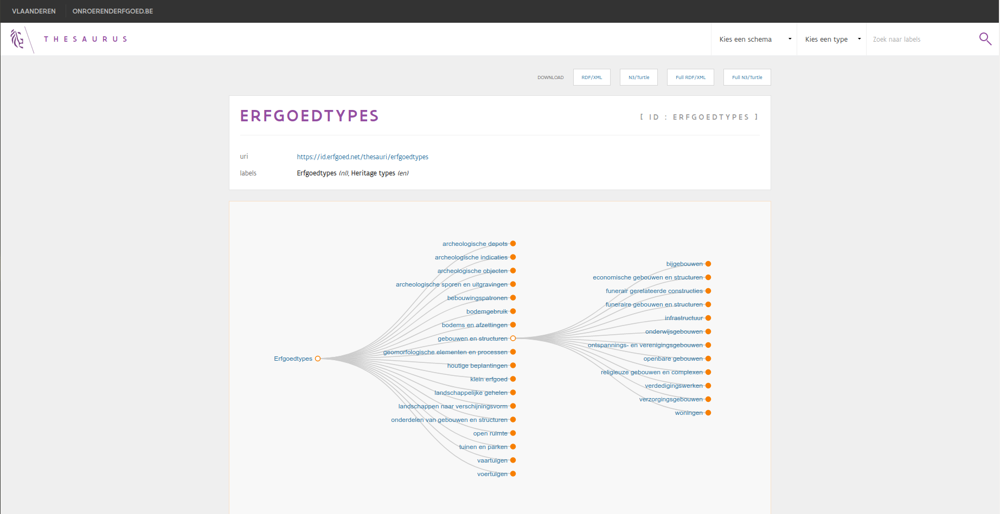

While every detail page presents the immediate relations for a certain concept
or collection, there's also a tree view available that presents all
broader/narrower relations for all concepts and collections in one go. This can be 
reached on the conceptscheme page or from every detail page. As can be seen
here, an Atramhasis instance can easily be reskinned for a certain
organisation. The `Flanders Heritage Thesaurus <https://thesaurus.onroerenderfgoed.be>`_ 
is an Atramhasis implementation with custom styling and authentication.

SKOS editor
===========

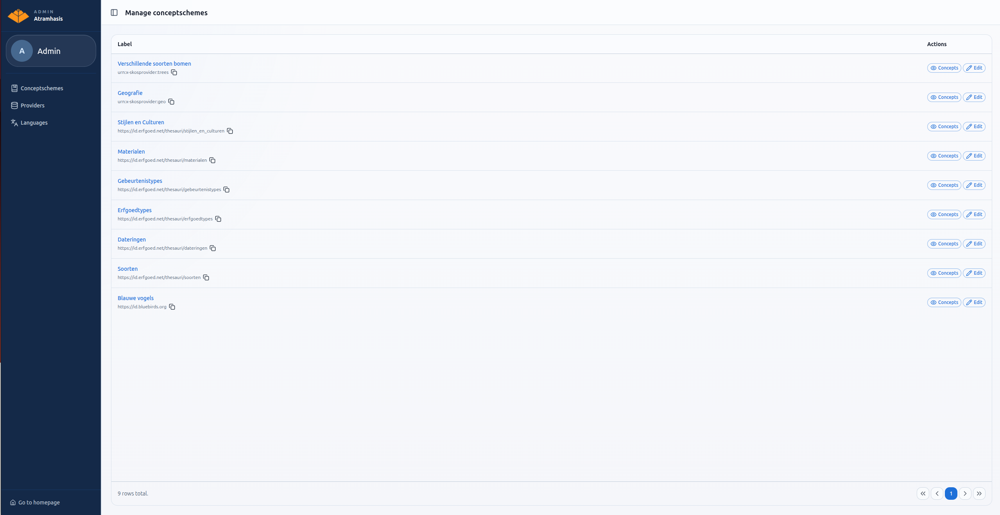

When opening the admin page, you arrive at the overview of conceptschemes.
From here, editors can quickly see the available conceptschemes and open one
for further editing.

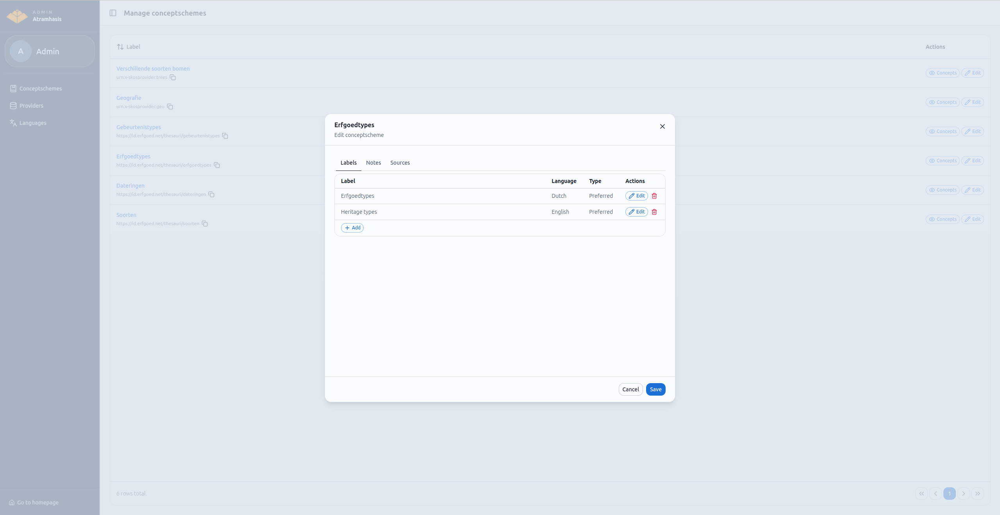

Conceptschemes can be edited from this screen. While conceptscheme attributes
can be adjusted here, new conceptschemes must be created in the Providers module.

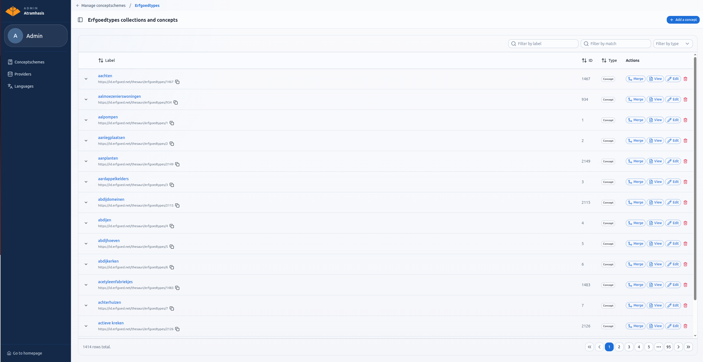

From the conceptscheme overview, you can click the Concepts button to open the
concepts and collections inside a conceptscheme. This gives you an overview of
all concepts and collections within that conceptscheme.

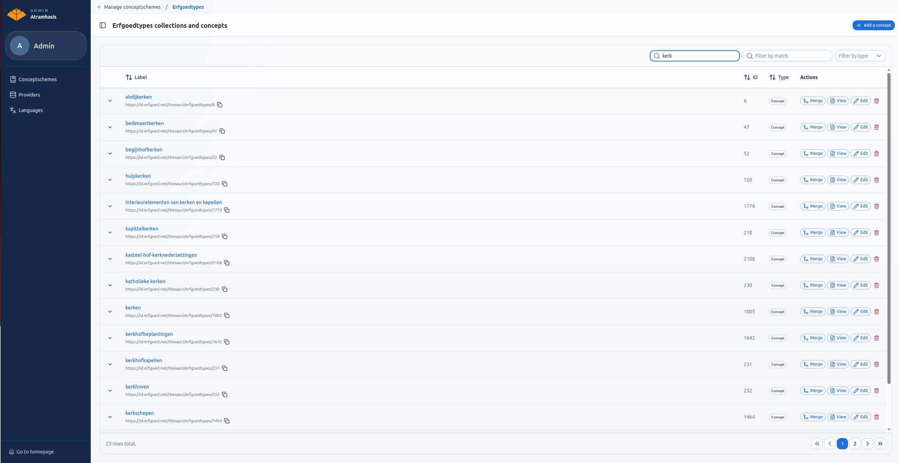

The concepts and collections overview also supports searching, making it easier
to find a specific concept or collection in a larger conceptscheme.

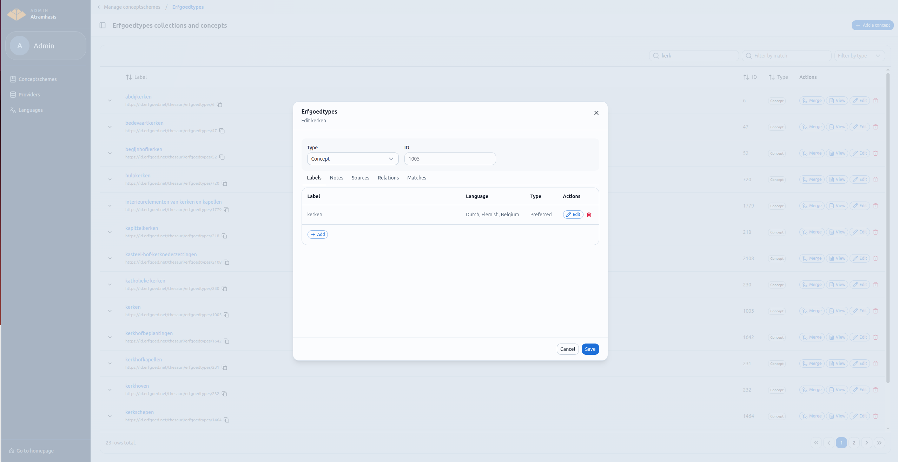

Editing a concept or collection is done using one or more tabs. The labels tab
lets you update the preferred labels and alternative labels for a concept or
collection.

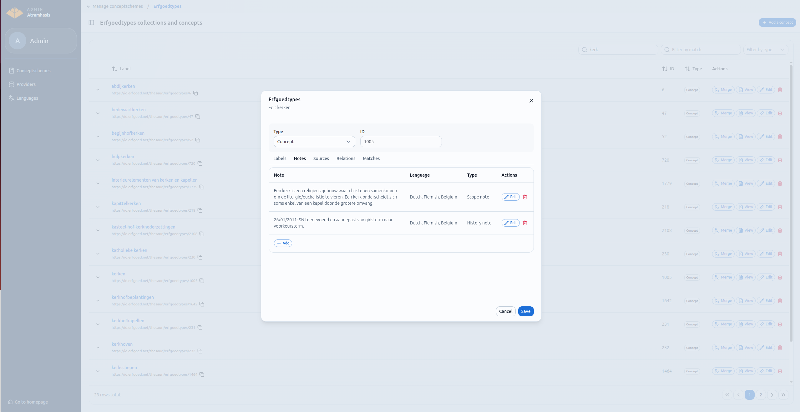

The notes tab is used to edit scopenotes, sourcenotes, and other notes. Adding
HTML markup is supported.

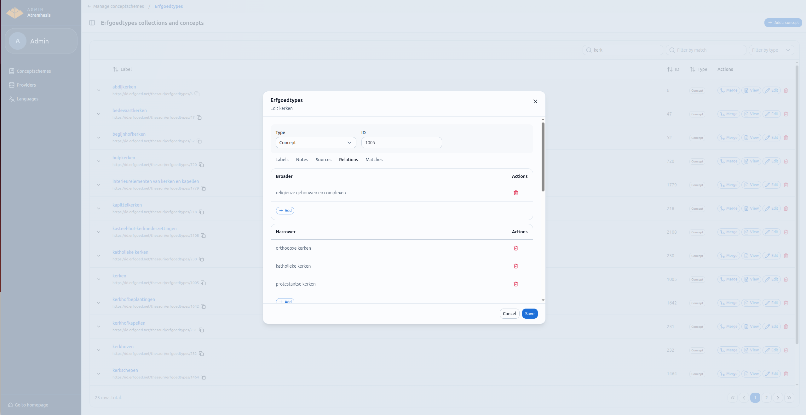

The relations tab allows editing the relations of concepts or collections with
other concepts or collections.

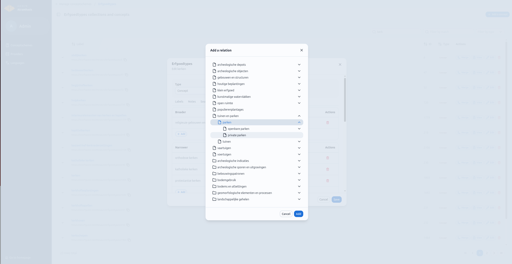

When adding a new relation, the interface helps you choose the appropriate
relation type and the related concept or collection. Dropdown lists are present
to facilitate editing.

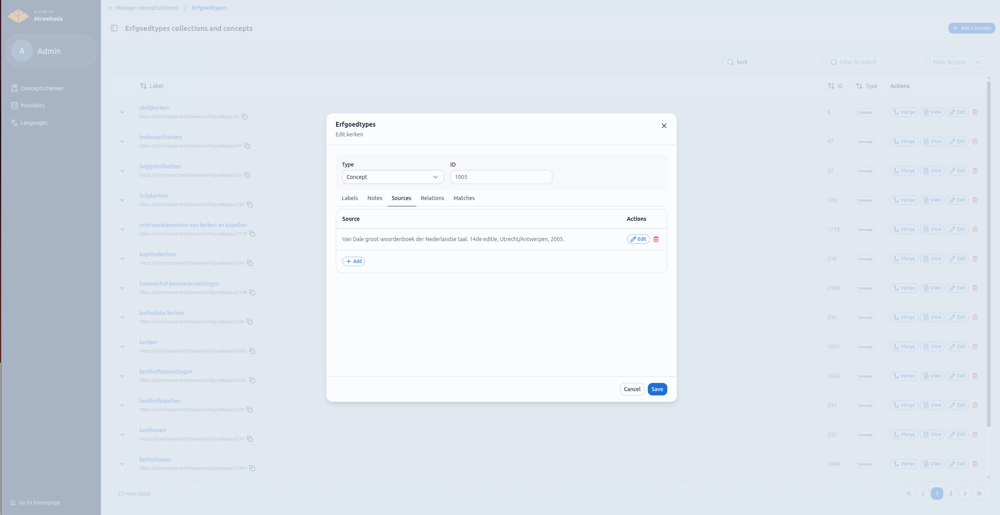

The sources tab allows editors to add and maintain the sources used in creating
or researching a concept or collection.

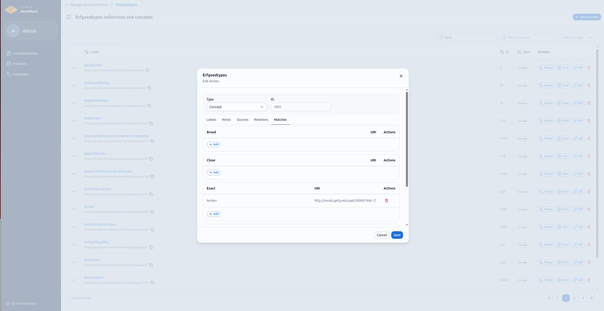

The matches tab allows an editor to match a local concept to a concept in a
remote conceptscheme.

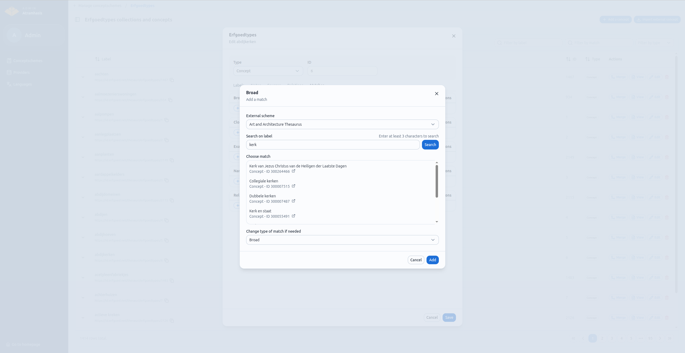

Using the `skosprovider` that powers a remote conceptscheme, matching
concepts can be searched for and added to the local concept.

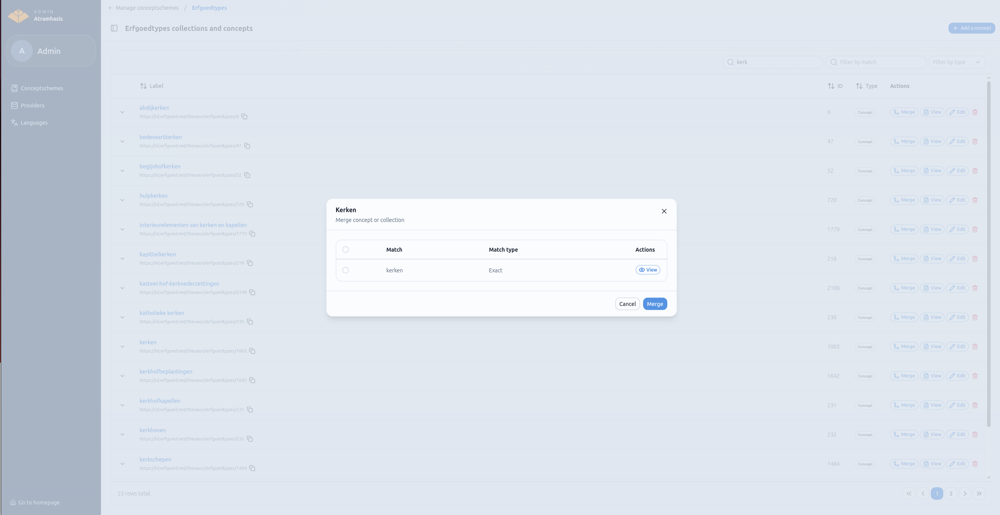

Once a concept has been matched with a concept from an external provider, it is
possible to merge the two concepts. This is similar to importing a concept, but
works for concepts that already exist in your local thesaurus. Merging copies
the labels and notes from the external concept. If you can link your concept to
an external concept that has labels for the concept in different languages,
this is a quick way to extend the number of languages supported by your local
concept. Before saving the results of the merge, you are free to review the
results and accept or reject certain labels and notes.

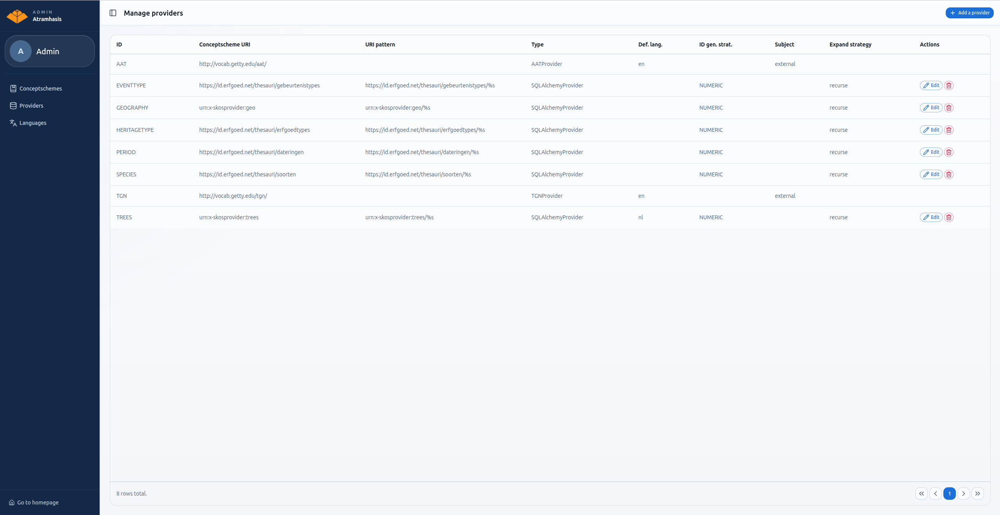

The providers screen gives an overview of all configured providers. From this
screen, you can create a new provider or open an existing provider for editing.

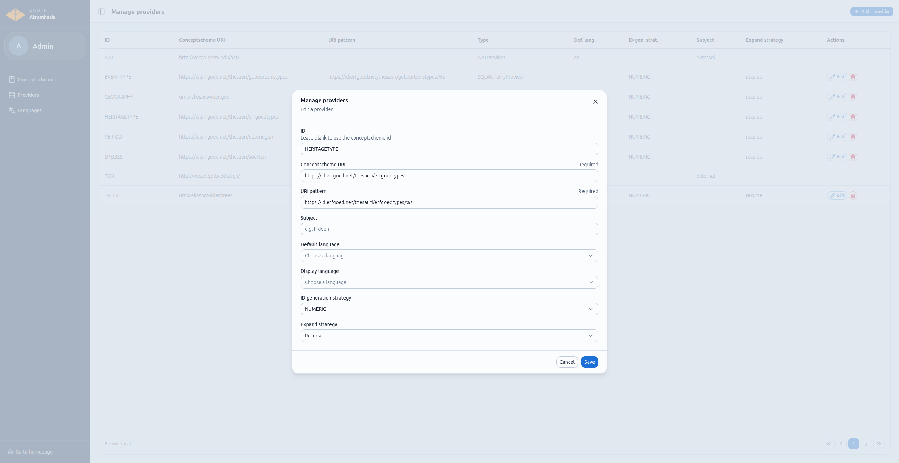

When editing a provider, you can update its configuration.

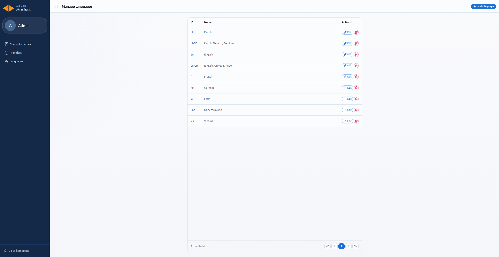

The languages screen allows editors to add all languages they want to use in
the application. You can choose from all IANA language tags.

LDF server
==========

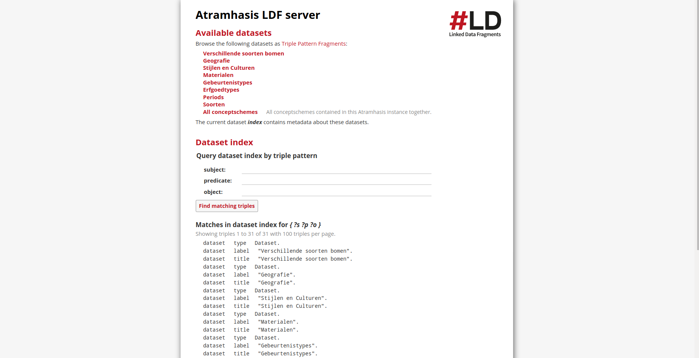

With a little bit of effort, Atramhasis can setup an LDF server for you,
allowing you to quickly serve RDF tripples.
